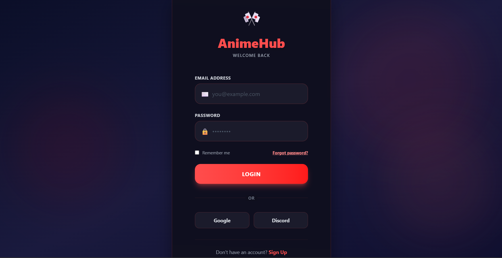

# AnimeHub

AnimeHub is a full-stack web application designed to provide a smooth and engaging anime browsing experience. The project emphasizes clean UI design, scalable architecture, and real-world development practices.

It demonstrates complete frontend–backend integration with user authentication, dynamic content rendering, and responsive design.

---

## Tech Stack

**Frontend**
- React.js
- JavaScript (ES6+)
- HTML5
- CSS3

**Backend**
- Node.js
- Express.js

**Database**
- MongoDB

**Tools**
- Git
- GitHub
- VS Code

---

## Features

- User authentication (Signup & Login)
- Secure backend API integration
- Dynamic anime listing
- Responsive and clean UI
- Modular and scalable architecture

---

## Versions Used

- Node.js: v18+
- npm: v9+
- React: v18+
- Express: v4+
- MongoDB: v6+

---

## Screenshots

### Signup Page


### Login Page


### Homepage


### Anime List


---

## How to Run the Project

### Backend
```bash
cd backend
npm install
npm start
