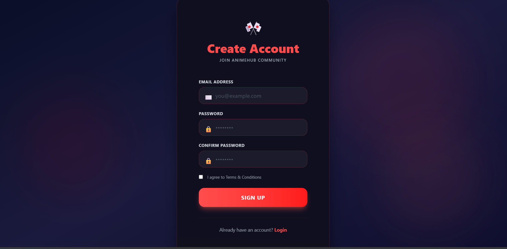
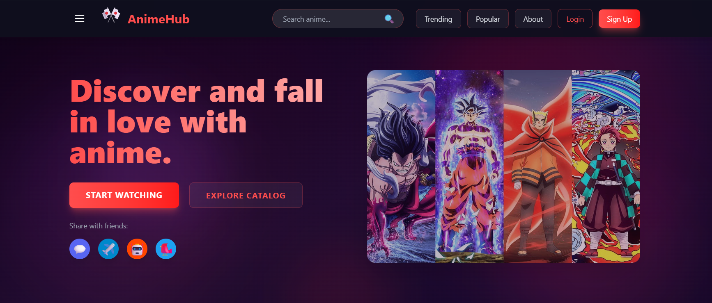
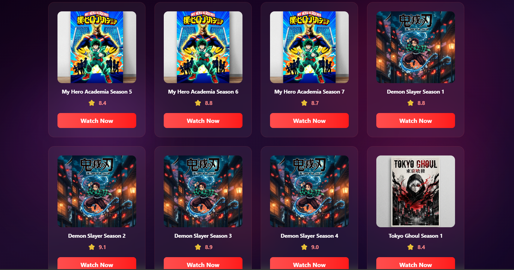
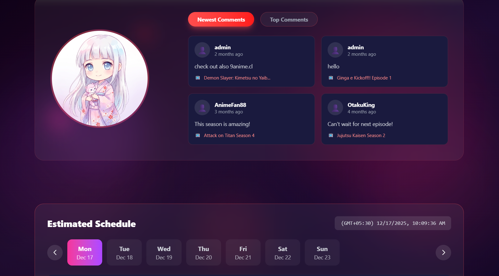

# AnimeHub

AnimeHub is a full-stack web application that provides an engaging and user-friendly platform for exploring anime content. The project demonstrates real-world frontend and backend integration with a focus on clean UI, scalability, and modern development practices.

It includes user authentication, dynamic anime listings, reviews, and user status updates, all wrapped in a responsive interface.

---

## Tech Stack

**Frontend**
- React.js
- JavaScript (ES6+)
- HTML5
- CSS3

**Backend**
- Node.js
- Express.js

**Database**
- MongoDB

**Tools**
- Git & GitHub
- VS Code

---

## Features

- User authentication (Signup & Login)
- Secure backend API integration
- Dynamic anime listing
- Anime reviews
- User status updates
- Responsive and clean UI
- Scalable full-stack architecture

---

## Versions Used

- Node.js: v18+
- npm: v9+
- React: v18+
- Express: v4+
- MongoDB: v6+

---

## Screenshots

### Signup Page


### Home page


### Anime List


### Review Page


### Status Page


---

## How to Run the Project

### Prerequisites
- Node.js (v18+ recommended)
- npm installed
- MongoDB running locally or via MongoDB Atlas

---

### Backend Setup
```bash
cd backend
npm install
npm start
